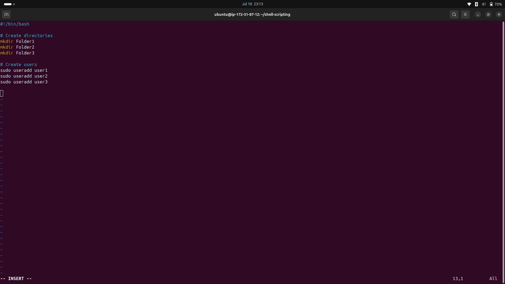
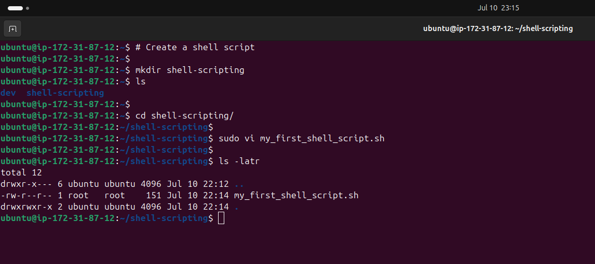
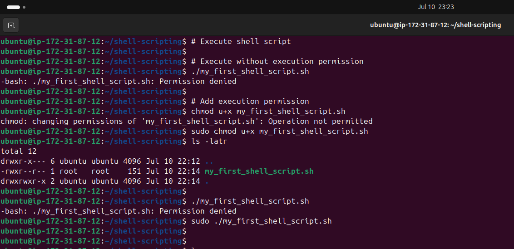
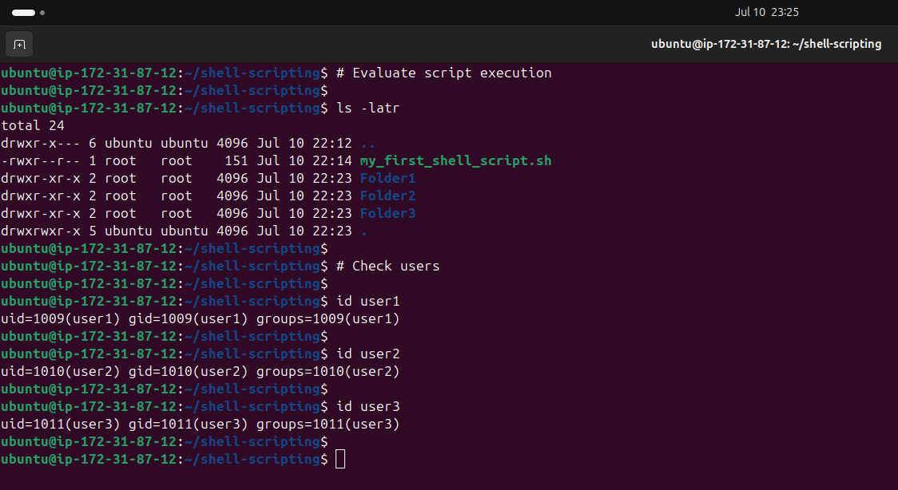
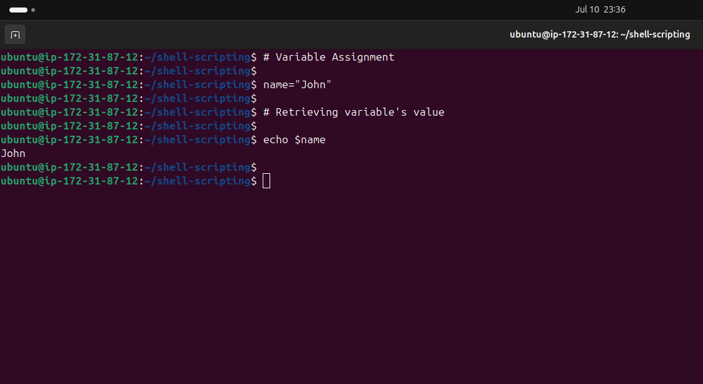

<!-- ABOUT THE PROJECT -->
## LINUX SHELL SCRIPTING (MINI)

### Objective

For this project, the following steps were taken to demonstrate shell scripting in linux:

- [LINUX SHELL SCRIPTING (MINI)](#linux-shell-scripting-mini)
  - [Objective](#objective)
    - [Shell Scripting](#shell-scripting)
    - [Basic Shell Script Demonstration](#basic-shell-script-demonstration)
    - [Variable](#variable)
      - [Variable Assignment](#variable-assignment)
      - [Value Retrieval](#value-retrieval)

----

#### Shell Scripting

It is the process of writing and executing a series of instructions in a shell.
It is used to automate tasks.

#### Basic Shell Script Demonstration

This will involve creating multiple folders and users at once via a script.

Create a folder named "shell-scripting".
Create a file named "my_first_shell_script.sh" in the "shell-scripting" folder.

Run the script without required execution permission.
Run the script with required execution permission.

Review the users and files created.

----

#### Variable

It  is a named storage location used to hold data, such as text strings, numbers, or the output of commands.

##### Variable Assignment

A variable is assigned a value through the use of the assignment operator (=).

----

##### Value Retrieval

The value of a variable is accessed by preceding the name of the variable with a dollar ($) symbol.

----

